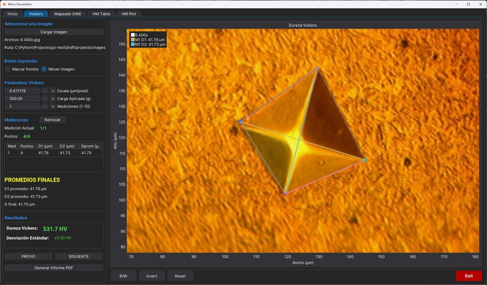
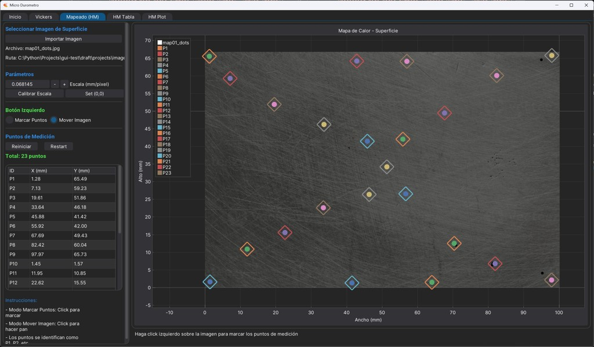
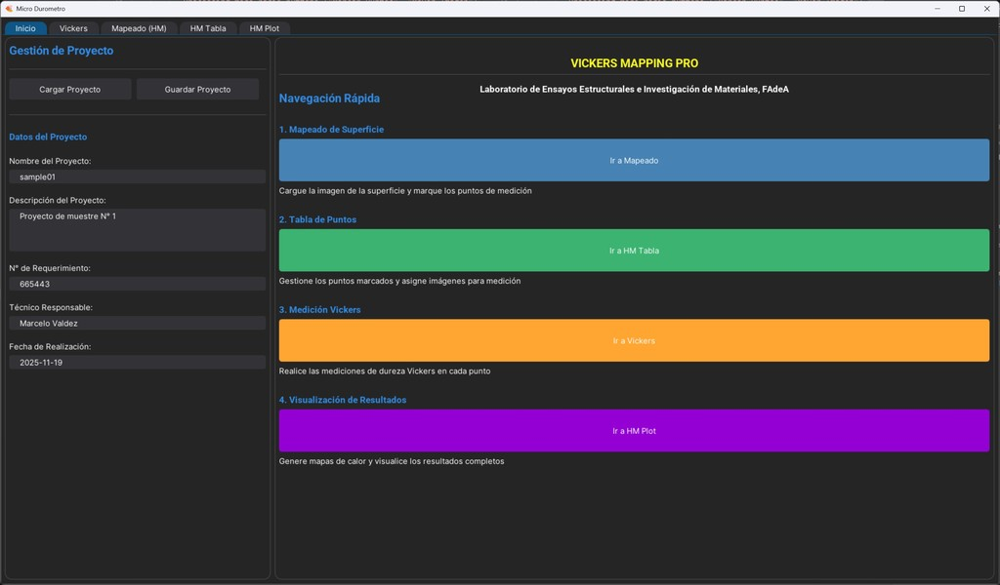
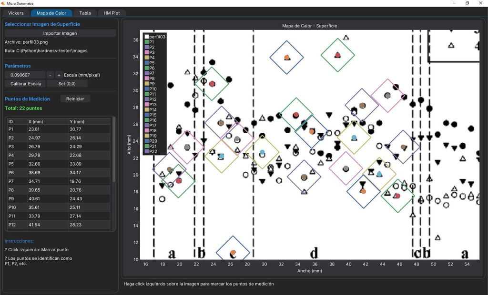
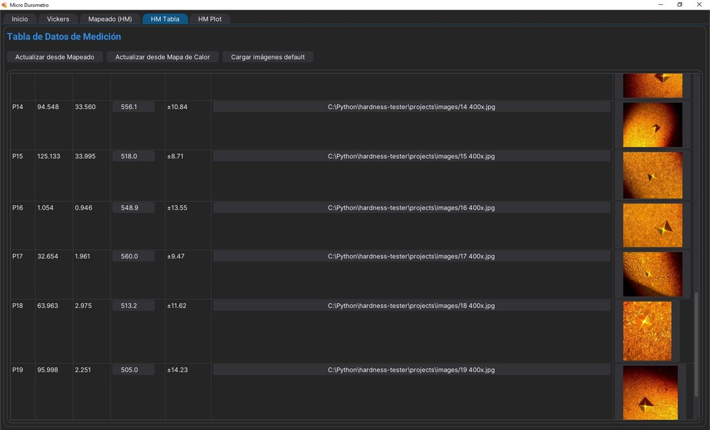
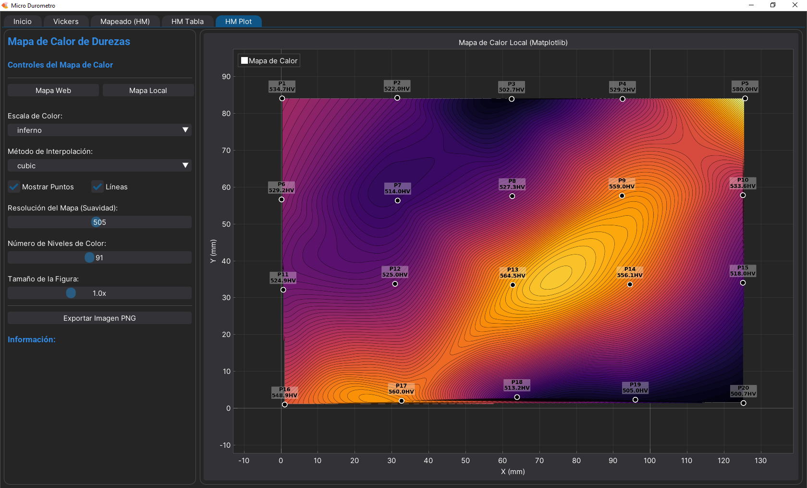
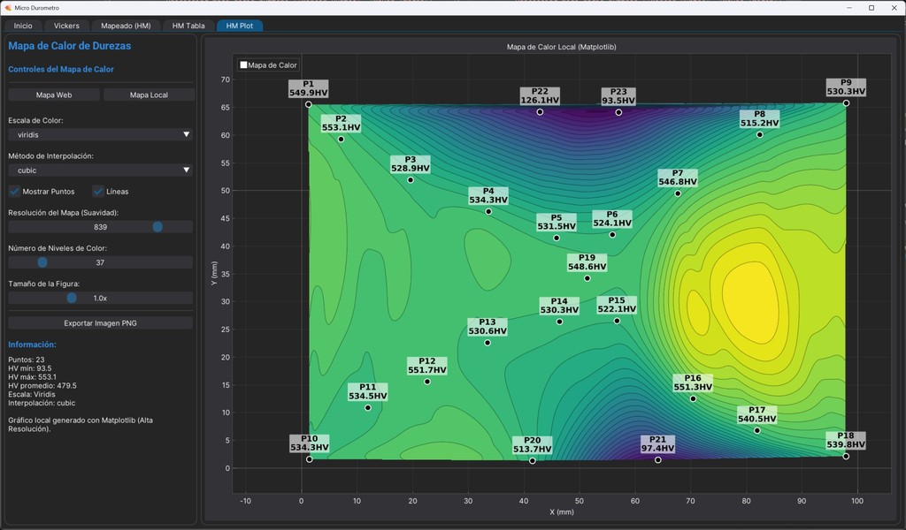
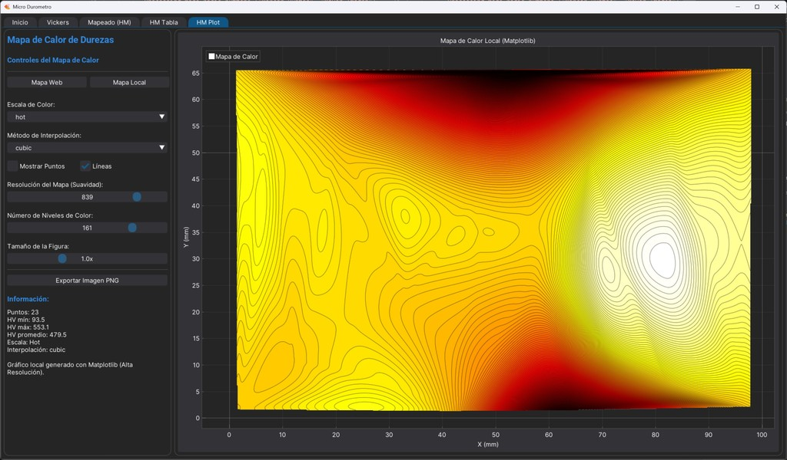
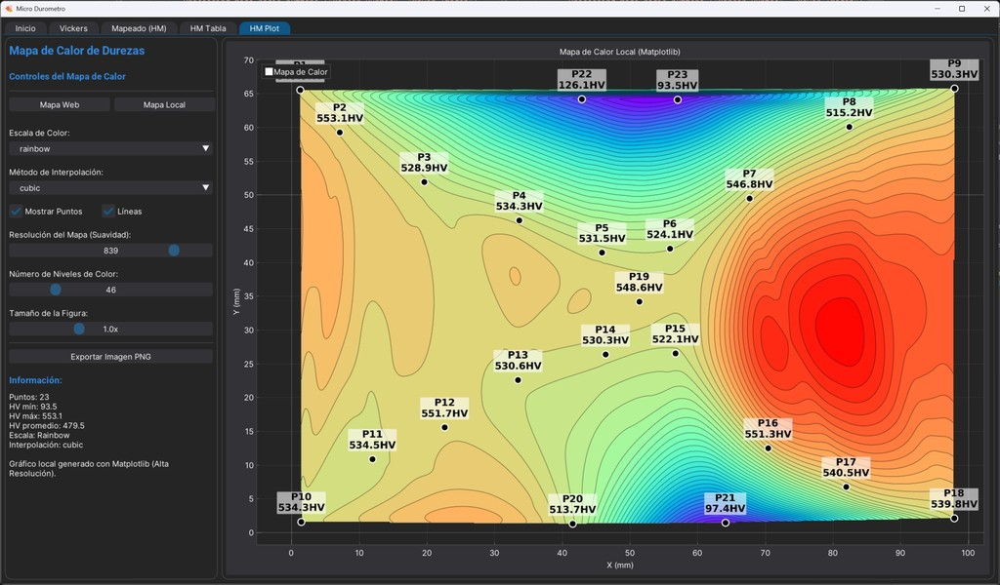
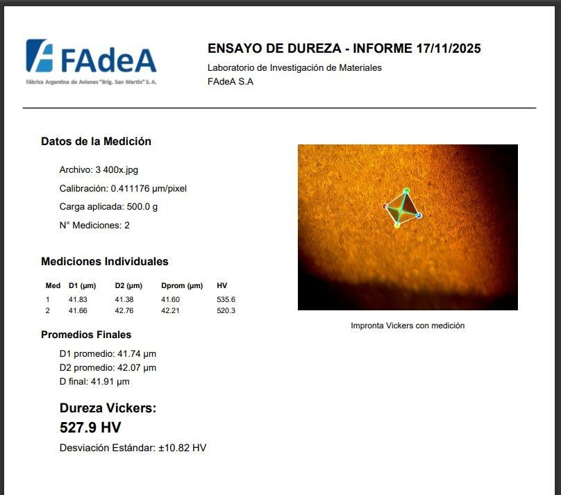

# Sistema de Medición de Dureza Vickers con Mapeo 2D


Sistema completo de medición automatizada para ensayos de dureza Vickers. Permite mediciones individuales con análisis estadístico y generación de mapas bidimensionales de dureza (heat maps) sobre superficies. Incluye gestión de proyectos, cálculo de desviación estándar y exportación de informes profesionales en PDF.

## 📋 Índice

- [Características](#características)
- [Flujos de Trabajo](#flujos-de-trabajo)
  - [Flujo 1: Medición Simple de Dureza Vickers](#flujo-1-medición-simple-de-dureza-vickers)
  - [Flujo 2: Mapeo Completo de Dureza (Heat Map)](#flujo-2-mapeo-completo-de-dureza-heat-map)
- [Requisitos](#requisitos)
- [Instalación](#instalación)
- [Uso Detallado](#uso-detallado)
- [Gestión de Proyectos](#gestión-de-proyectos)
- [Capturas de Pantalla](#capturas-de-pantalla)
- [Arquitectura](#arquitectura)
- [Configuración](#configuración)
- [Fórmula de Dureza Vickers](#fórmula-de-dureza-vickers)
- [Autor](#autor)
- [Licencia](#licencia)



## Características

### Medición de Dureza Vickers
- **Medición Interactiva**: Interfaz gráfica intuitiva para marcar los vértices de la impronta Vickers
- **Mediciones Múltiples**: Capacidad de realizar entre 1 y 10 mediciones sobre la misma imagen
- **Cálculo Estadístico**: Promedios de diagonales y desviación estándar de dureza
- **Calibración Precisa**: Sistema de calibración con entrada de alta precisión (6 decimales)
- **Cálculo Automático**: Determinación automática de dureza Vickers según la fórmula estándar: HV = 1.854 × F / d²
- **Visualización en Tiempo Real**: Actualización dinámica de diagonales y mediciones con tabla detallada

### Mapeo de Dureza (Heat Map)
- **Imagen de Superficie**: Carga de imagen de superficie completa para marcado de puntos de medición
- **Marcado de Puntos**: Sistema de coordenadas con offset de origen ajustable
- **Asignación de Imágenes**: Vinculación de imágenes microscópicas a cada punto de medición
- **Tabla de Datos**: Gestión completa de puntos con coordenadas X-Y, dureza HV y desviación estándar
- **Generación de Heat Maps**: 
  - Visualización bidimensional con interpolación (linear, nearest, cubic)
  - Múltiples escalas de color (Viridis, Plasma, Inferno, Magma, Cividis, Turbo, Jet, etc.)
  - Control de resolución de malla y niveles de contorno
  - Exportación en formatos PNG, JPG y HTML interactivo (Plotly)
- **Heat Maps Locales**: Generación con matplotlib para exportación rápida

### Gestión de Proyectos
- **Guardar/Cargar Proyectos**: Sistema completo de persistencia en formato JSON
- **Rutas Relativas**: Gestión inteligente de rutas de imágenes para portabilidad de proyectos
- **Información del Proyecto**: Nombre, descripción, requerimiento, técnico, fecha
- **Persistencia Completa**: Todos los datos, configuraciones y estados se guardan automáticamente
- **Carpeta de Proyecto**: Memoria del último directorio utilizado para todas las operaciones de archivo

### Generación de Informes
- **Informes PDF Profesionales**: Exportación automática con:
  - Datos de medición (calibración, carga aplicada, número de mediciones)
  - Tabla de mediciones individuales con D1, D2, Dprom y HV
  - Desviación estándar para cada punto de medición
  - Promedios finales de todas las mediciones
  - Dureza promedio con desviación estándar
  - Imágenes anotadas con geometría de improntas marcadas
  - Tabla completa de puntos con coordenadas, dureza y desviación estándar
  - Logo institucional y metadatos
- **Soporte para Múltiples Fuentes**: Informes desde mediciones Vickers o desde tabla de datos

### Procesamiento de Imagen
- **Herramientas de Conversión**: B/W (blanco y negro), inversión y reseteo de imagen
- **Zoom y Pan**: Navegación fluida por imágenes de alta resolución
- **Vistas Previas**: Miniaturas de imágenes en tabla de datos



## Flujos de Trabajo

El sistema soporta dos flujos de trabajo principales según las necesidades del ensayo:

### Flujo 1: Medición Simple de Dureza Vickers

Este flujo está diseñado para realizar mediciones de dureza sobre una única muestra con análisis estadístico.

#### Pasos:

**a. Acceder a la pestaña "Vickers"**
   - Seleccionar la pestaña "Vickers" en la interfaz principal

**b. Cargar imagen del durómetro (400x)**
   - Hacer clic en "Importar Imagen"
   - Seleccionar la imagen microscópica de la impronta Vickers

**c. Verificar la escala en µm/px**
   - Comprobar el valor de calibración del microscopio
   - Ajustar si es necesario (valores típicos: 0.2-0.5 µm/px para 400x)

**d. Indicar la carga aplicada [g]**
   - Ingresar el valor de carga utilizada en el durómetro
   - Valores comunes: 100g, 200g, 500g, 1000g

**e. Establecer la cantidad de mediciones a efectuar para promediar**
   - Seleccionar entre 1 y 10 mediciones
   - Recomendado: 3-5 mediciones para análisis estadístico confiable

**f. Marcar los cuatro vértices de la impronta n veces**
   - Cambiar al modo "Marcar Puntos"
   - Hacer clic en los 4 vértices de cada impronta
   - El sistema calcula automáticamente D1, D2 y HV para cada medición
   - Repetir para cada una de las n mediciones configuradas
   - Al completar todas las mediciones, se calculan promedios y desviación estándar

**g. Generar informe Vickers**
   - Hacer clic en "Generar Informe PDF"
   - El informe incluye:
     - Tabla con todas las mediciones individuales
     - Promedios de diagonales D1 y D2
     - Dureza promedio con desviación estándar
     - Imagen anotada con todas las improntas marcadas

---

### Flujo 2: Mapeo Completo de Dureza (Heat Map)

Este flujo permite crear mapas bidimensionales de distribución de dureza sobre una superficie completa.

#### Pasos:

**a. Cargar imagen de superficie y marcar puntos de medición (pestaña "Mapeado")**
   - Ir a la pestaña "Mapeado"
   - Hacer clic en "Abrir Archivo" para cargar la imagen de la superficie completa
   - Verificar la calibración en µm/px
   - Ajustar el offset de origen si es necesario (coordenadas X=0, Y=0)
   - Cambiar al modo "Marcar Puntos"
   - Hacer clic en cada posición de la superficie donde se realizó una medición
   - Los puntos se numeran automáticamente (P1, P2, P3, ...)
   - Guardar el proyecto para preservar el trabajo

**b. Asignar imágenes de muestras Vickers a cada punto (pestaña "HM Tabla")**
   - Ir a la pestaña "HM Tabla"
   - Para cada punto de la tabla, hacer clic en "Seleccionar" para asignar la imagen microscópica correspondiente
   - **Opción automática**: Si las imágenes siguen la nomenclatura estándar (1 400x.jpg, 2 400x.jpg, ...), usar "Asignar Imágenes Automáticamente"
   - Verificar las miniaturas en la columna "Vista Previa"

**c. Realizar mediciones de dureza para cada punto**
   - En la tabla de "HM Tabla", hacer clic en la vista previa del primer punto
   - Esto abre automáticamente la imagen en la pestaña "Vickers"
   - Seguir el **Flujo 1** para realizar las mediciones:
     - Verificar calibración y carga
     - Configurar número de mediciones (recomendado: 3)
     - Marcar los 4 vértices n veces
     - El sistema calcula automáticamente HV y desviación estándar
     - Al completar, los valores se guardan automáticamente en la tabla
   - Regresar a "HM Tabla" y repetir para el siguiente punto
   - Continuar hasta completar todos los puntos de medición

**d. Visualizar el mapa de calor (pestaña "HM Plot")**
   - Ir a la pestaña "HM Plot"
   - Configurar opciones de visualización:
     - **Escala de Color**: Viridis, Plasma, Inferno, Magma, Jet, etc.
     - **Interpolación**: Linear, Nearest, Cubic
     - **Mostrar Puntos**: Ver/ocultar puntos de medición
     - **Mostrar Líneas**: Ver/ocultar líneas de contorno
     - **Resolución de Malla**: Densidad de interpolación (100-1000)
     - **Niveles de Contorno**: Cantidad de bandas de color (10-100)
     - **Escala de Figura**: Tamaño de visualización (0.5x-2.0x)
   - Hacer clic en "Generar Mapa de Calor" para visualización interactiva (Plotly)
   - O "Generar Mapa Local" para exportación rápida (Matplotlib)
   - El mapa muestra la distribución bidimensional de dureza con interpolación

**e. Generar el informe completo del proyecto**
   - Hacer clic en "Informe PDF"
   - El informe incluye:
     - Información del proyecto (nombre, descripción, requerimiento, técnico, fecha)
     - Tabla completa de puntos con:
       - ID del punto
       - Coordenadas X, Y (mm)
       - Dureza HV
       - Desviación estándar
       - Ruta de imagen
     - Miniaturas de muestras microscópicas
     - Estadísticas generales del proyecto
   - Hacer clic en "Exportar HeatMap" para guardar el mapa de calor:
     - Formato PNG o JPG para figuras estáticas
     - Formato HTML para visualización interactiva con Plotly (zoom, pan, tooltips)

---

## Requisitos

- Python 3.8+
- DearPyGUI 2.1.1+
- ReportLab 4.4.4+
- Pillow (PIL) 12.0.0+
- Matplotlib (latest)
- Plotly (latest)
- NumPy
- SciPy (para interpolación)
- Rich (para logs en terminal)

## Instalación

1. Clonar el repositorio:
```bash
git clone https://github.com/marzzelo/hardness-tester.git
cd hardness-tester
```

2. Crear entorno virtual e instalar dependencias:
```bash
python -m venv .venv
.venv\Scripts\activate  # Windows
# source .venv/bin/activate  # Linux/Mac
pip install -r requirements.txt
```

3. Ejecutar la aplicación:
```bash
python main.py
```

## Uso Detallado

### Pestaña Vickers - Mediciones Individuales

#### 1. Cargar Imagen
- Clic en "Importar Imagen" para seleccionar la imagen de la impronta
- Ajustar la calibración (µm/pixel) según el equipo microscópico utilizado
- Configurar la carga aplicada en gramos
- Especificar el número de mediciones a realizar (1-10)

#### 2. Modo de Operación
- **Mover Imagen**: Navegar por la imagen (pan con botón izquierdo en modo Mover, botón derecho en modo Marcar)
- **Marcar Puntos**: Hacer clic en los 4 vértices de la impronta Vickers para cada medición

#### 3. Proceso de Medición
El sistema guía al usuario a través de múltiples mediciones:

1. **Seleccionar modo "Marcar Puntos"**
2. **Marcar 4 puntos** en los vértices de la primera impronta
   - El sistema muestra: "Medición Actual: 1/N" y "Puntos: X/4"
   - Al completar 4 puntos, se calcula automáticamente D1, D2, Dprom y HV
3. **Continuar con las siguientes mediciones** hasta completar N mediciones
   - Cada medición completa se agrega a la tabla de resultados
   - Los puntos permanecen visibles en el gráfico
4. **Al completar todas las mediciones**:
   - Aparece el título "PROMEDIOS FINALES" en verde
   - Se muestran los promedios de D1, D2 y D final
   - Se calcula la dureza promedio y desviación estándar
   - Los valores se actualizan automáticamente en HM Tabla si se está en un flujo de mapeo
   - El sistema bloquea la entrada de nuevos puntos

#### 4. Control de Mediciones
- **Reiniciar**: Botón disponible en todo momento para limpiar y comenzar un nuevo conjunto de mediciones
- **Bloqueo automático**: Después de completar las N mediciones, no se pueden agregar más puntos hasta reiniciar
- **Herramientas de imagen**: B/W (blanco y negro), Invert (invertir colores), Reset (restaurar original)

#### 5. Generar Informe
- Completar todas las mediciones configuradas
- Clic en "Generar Informe PDF"
- Seleccionar ubicación y nombre del archivo
- El informe incluye:
  - Tabla con todas las mediciones individuales
  - Promedios finales de diagonales
  - Dureza Vickers promedio con desviación estándar
  - Imagen con todas las improntas marcadas y anotadas

#### 6. Repetir Ensayo
- Después de exportar el PDF (opcional), presionar "Reiniciar"
- El sistema limpia todas las mediciones pero mantiene la imagen cargada
- Permite realizar un nuevo conjunto de N mediciones sobre la misma imagen

### Pestaña Mapeado - Imagen de Superficie

#### Configuración Inicial
- **Abrir Archivo**: Cargar imagen de la superficie completa
- **Calibración**: Verificar/ajustar la escala µm/px
- **Offset de Origen**: Establecer coordenadas del punto (0,0)
  - Por defecto: esquina inferior izquierda de la imagen
  - Ajustar X e Y para reposicionar el origen

#### Marcado de Puntos
- Cambiar al modo "Marcar Puntos"
- Hacer clic en cada posición donde se realizó una medición
- Los puntos se numeran automáticamente (P1, P2, P3, ...)
- Coordenadas en mm mostradas en tiempo real
- **Nota**: Solo se marcan posiciones, las durezas se miden después

#### Gestión de Puntos
- **Ver Todos los Puntos**: Lista de coordenadas en panel inferior
- **Eliminar Último Punto**: Remover el último punto marcado
- **Reiniciar Puntos**: Limpiar todos los puntos (mantiene la imagen)
- **Guardar Proyecto**: Preservar imagen, puntos y configuración

### Pestaña HM Tabla - Gestión de Datos

#### Estructura de la Tabla
- **ID**: Identificador del punto (P1, P2, ...)
- **X (mm)**: Coordenada X en la superficie
- **Y (mm)**: Coordenada Y en la superficie
- **HV**: Dureza Vickers (calculada desde pestaña Vickers)
- **Std Dev**: Desviación estándar (±X.XX)
- **Ruta Imagen**: Path de la imagen microscópica asociada
- **Vista Previa**: Miniatura de la imagen

#### Asignación de Imágenes
- **Manual**: Botón "Seleccionar" en cada fila para asignar imagen individual
- **Automática**: Botón "Asignar Imágenes Automáticamente"
  - Requiere nomenclatura: `1 400x.jpg`, `2 400x.jpg`, etc.
  - Busca en el directorio seleccionado
  - Asocia automáticamente por número de punto

#### Actualización de Valores
- **Desde Vickers**: Al completar mediciones en pestaña Vickers, el punto activo se actualiza automáticamente
- **Manual**: Ingresar valores HV directamente en la tabla
- **Desde Heat Map**: Botón "Actualizar desde HM" para valores interpolados
- Los valores de desviación estándar se calculan automáticamente cuando se realizan múltiples mediciones

#### Operaciones sobre la Tabla
- **Exportar a CSV**: Guardar tabla completa
- **Limpiar Tabla**: Remover todos los datos (mantiene estructura)
- **Actualizar desde HM**: Llenar valores HV desde interpolación del mapa de calor

### Pestaña HM Plot - Visualización de Mapas

#### Configuración de Visualización
- **Escala de Color**: 
  - Secuenciales: Viridis, Plasma, Inferno, Magma, Cividis
  - Divergentes: RdBu, Coolwarm, Spectral
  - Cualitativos: Jet, Turbo, Rainbow
- **Interpolación**:
  - Linear: interpolación lineal (rápida)
  - Nearest: vecino más cercano (sin suavizado)
  - Cubic: interpolación cúbica (más suave)
- **Mostrar Puntos**: Visualizar puntos de medición sobre el mapa
- **Mostrar Líneas**: Mostrar líneas de contorno
- **Resolución de Malla**: 100-1000 (mayor = más detallado, más lento)
- **Niveles de Contorno**: 10-100 bandas de color
- **Escala de Figura**: 0.5x - 2.0x tamaño de visualización

#### Generación de Mapas
- **Generar Mapa de Calor (Plotly)**:
  - Visualización interactiva en el navegador
  - Zoom, pan, tooltips con valores
  - Exportable a HTML para compartir
- **Generar Mapa Local (Matplotlib)**:
  - Figura estática de alta calidad
  - Ideal para exportación rápida a PNG/JPG
  - Incluye barra de color y etiquetas

#### Exportación
- **Exportar HeatMap**: Guardar figura en disco
  - PNG: imagen de alta calidad para documentos
  - JPG: imagen comprimida para web
  - HTML: archivo interactivo (solo Plotly)

### Gestión de Proyectos

#### Guardar Proyecto
- Menú: Proyecto → Guardar o Guardar Como
- Formato: JSON con toda la información del proyecto
- Incluye:
  - Información general (nombre, descripción, requerimiento, técnico, fecha)
  - Datos de calibración Vickers
  - Mediciones completas con geometría de improntas
  - Imagen de superficie y puntos marcados
  - Tabla de datos con HV y desviación estándar
  - Configuración de visualización del heat map
- **Rutas Relativas**: Las imágenes se guardan con rutas relativas al archivo del proyecto para portabilidad

#### Cargar Proyecto
- Menú: Proyecto → Abrir
- Restaura completamente el estado del proyecto:
  - Imagen de superficie con puntos dibujados
  - Tabla de datos con todos los valores
  - Configuración de controles en todas las pestañas
  - Imágenes microscópicas asociadas
- **Resolución de Rutas**: Las rutas relativas se resuelven automáticamente desde el directorio del proyecto

#### Nuevo Proyecto
- Menú: Proyecto → Nuevo
- Abre diálogo para configurar:
  - Nombre del proyecto
  - Descripción
  - Número de requerimiento
  - Técnico responsable
  - Fecha
- Limpia todos los datos previos y prepara el sistema para un nuevo ensayo

## Gestión de Proyectos
3. **Continuar con las siguientes mediciones** hasta completar N mediciones
   - Cada medición completa se agrega a la tabla de resultados
   - Los puntos permanecen visibles en el gráfico
4. **Al completar todas las mediciones**:
   - Aparece el título "PROMEDIOS FINALES" en verde
   - Se muestran los promedios de D1, D2 y D final
   - Se calcula la dureza promedio y desviación estándar
   - El sistema bloquea la entrada de nuevos puntos

### 4. Control de Mediciones
- **Reiniciar**: Botón disponible en todo momento para limpiar y comenzar un nuevo conjunto de mediciones
- **Bloqueo automático**: Después de completar las N mediciones, no se pueden agregar más puntos hasta reiniciar
- **Herramientas de imagen**: B/W (blanco y negro), Invert (invertir colores), Reset (restaurar original)

### 5. Generar Informe
- Completar todas las mediciones configuradas
- Clic en "Generar Informe PDF"
- Seleccionar ubicación y nombre del archivo
- El informe incluye:
  - Tabla con todas las mediciones individuales
  - Promedios finales de diagonales
  - Dureza Vickers promedio con desviación estándar
  - Imagen con todas las improntas marcadas y anotadas

### 6. Repetir Ensayo
- Después de exportar el PDF (opcional), presionar "Reiniciar"
- El sistema limpia todas las mediciones pero mantiene la imagen cargada
- Permite realizar un nuevo conjunto de N mediciones sobre la misma imagen

### Pestaña Mapeado - Imagen de Superficie

#### Configuración Inicial
- **Abrir Archivo**: Cargar imagen de la superficie completa
- **Calibración**: Verificar/ajustar la escala µm/px
- **Offset de Origen**: Establecer coordenadas del punto (0,0)
  - Por defecto: esquina inferior izquierda de la imagen
  - Ajustar X e Y para reposicionar el origen

#### Marcado de Puntos
- Cambiar al modo "Marcar Puntos"
- Hacer clic en cada posición donde se realizó una medición
- Los puntos se numeran automáticamente (P1, P2, P3, ...)
- Coordenadas en mm mostradas en tiempo real
- **Nota**: Solo se marcan posiciones, las durezas se miden después

#### Gestión de Puntos
- **Ver Todos los Puntos**: Lista de coordenadas en panel inferior
- **Eliminar Último Punto**: Remover el último punto marcado
- **Reiniciar Puntos**: Limpiar todos los puntos (mantiene la imagen)
- **Guardar Proyecto**: Preservar imagen, puntos y configuración

### Pestaña HM Tabla - Gestión de Datos

#### Estructura de la Tabla
- **ID**: Identificador del punto (P1, P2, ...)
- **X (mm)**: Coordenada X en la superficie
- **Y (mm)**: Coordenada Y en la superficie
- **HV**: Dureza Vickers (calculada desde pestaña Vickers)
- **Std Dev**: Desviación estándar (±X.XX)
- **Ruta Imagen**: Path de la imagen microscópica asociada
- **Vista Previa**: Miniatura de la imagen

#### Asignación de Imágenes
- **Manual**: Botón "Seleccionar" en cada fila para asignar imagen individual
- **Automática**: Botón "Asignar Imágenes Automáticamente"
  - Requiere nomenclatura: `1 400x.jpg`, `2 400x.jpg`, etc.
  - Busca en el directorio seleccionado
  - Asocia automáticamente por número de punto

#### Actualización de Valores
- **Desde Vickers**: Al completar mediciones en pestaña Vickers, el punto activo se actualiza automáticamente
- **Manual**: Ingresar valores HV directamente en la tabla
- **Desde Heat Map**: Botón "Actualizar desde HM" para valores interpolados
- Los valores de desviación estándar se calculan automáticamente cuando se realizan múltiples mediciones

#### Operaciones sobre la Tabla
- **Exportar a CSV**: Guardar tabla completa
- **Limpiar Tabla**: Remover todos los datos (mantiene estructura)
- **Actualizar desde HM**: Llenar valores HV desde interpolación del mapa de calor

### Pestaña HM Plot - Visualización de Mapas

#### Configuración de Visualización
- **Escala de Color**: 
  - Secuenciales: Viridis, Plasma, Inferno, Magma, Cividis
  - Divergentes: RdBu, Coolwarm, Spectral
  - Cualitativos: Jet, Turbo, Rainbow
- **Interpolación**:
  - Linear: interpolación lineal (rápida)
  - Nearest: vecino más cercano (sin suavizado)
  - Cubic: interpolación cúbica (más suave)
- **Mostrar Puntos**: Visualizar puntos de medición sobre el mapa
- **Mostrar Líneas**: Mostrar líneas de contorno
- **Resolución de Malla**: 100-1000 (mayor = más detallado, más lento)
- **Niveles de Contorno**: 10-100 bandas de color
- **Escala de Figura**: 0.5x - 2.0x tamaño de visualización

#### Generación de Mapas
- **Generar Mapa de Calor (Plotly)**:
  - Visualización interactiva en el navegador
  - Zoom, pan, tooltips con valores
  - Exportable a HTML para compartir
- **Generar Mapa Local (Matplotlib)**:
  - Figura estática de alta calidad
  - Ideal para exportación rápida a PNG/JPG
  - Incluye barra de color y etiquetas

#### Exportación
- **Exportar HeatMap**: Guardar figura en disco
  - PNG: imagen de alta calidad para documentos
  - JPG: imagen comprimida para web
  - HTML: archivo interactivo (solo Plotly)

## Gestión de Proyectos

Los proyectos se guardan en formato JSON con toda la información necesaria para restaurar completamente el estado del trabajo. El sistema utiliza rutas relativas para las imágenes, lo que permite mover carpetas de proyectos a diferentes ubicaciones o equipos sin perder las referencias.

### Estructura de un Proyecto

```json
{
  "info": {
    "nombre": "Proyecto Demo 01",
    "descripcion": "Análisis de dureza superficial",
    "requerimiento": "REQ-2025-001",
    "tecnico": "Ing. Marcelo Valdez",
    "fecha": "2025-11-20"
  },
  "vickers": {
    "calibration": 0.411,
    "load": 500.0,
    "measurements": [...],
    "n_measurements": 3
  },
  "heatmap": {
    "calibration": 0.206,
    "points": [[x1, y1], [x2, y2], ...],
    "origin_offset": [0, 0],
    "image_path": "images/surface01.jpg"
  },
  "table": {
    "data": [
      {
        "id": "P1",
        "x": 0.329,
        "y": 84.003,
        "hv": 534.67,
        "std_dev": 10.48,
        "image_path": "images/1 400x.jpg"
      },
      ...
    ]
  },
  "hmplot": {
    "colorscale": "Inferno",
    "interpolation": "cubic",
    "show_points": true,
    "show_lines": true,
    "grid_resolution": 500,
    "contour_levels": 90,
    "figure_scale": 1.0
  }
}
```

### Operaciones de Proyecto

#### Guardar Proyecto
- Menú: Proyecto → Guardar o Guardar Como
- Formato: JSON con toda la información del proyecto
- Incluye:
  - Información general (nombre, descripción, requerimiento, técnico, fecha)
  - Datos de calibración Vickers
  - Mediciones completas con geometría de improntas
  - Imagen de superficie y puntos marcados
  - Tabla de datos con HV y desviación estándar
  - Configuración de visualización del heat map
- **Rutas Relativas**: Las imágenes se guardan con rutas relativas al archivo del proyecto para portabilidad

#### Cargar Proyecto
- Menú: Proyecto → Abrir
- Restaura completamente el estado del proyecto:
  - Imagen de superficie con puntos dibujados
  - Tabla de datos con todos los valores
  - Configuración de controles en todas las pestañas
  - Imágenes microscópicas asociadas
- **Resolución de Rutas**: Las rutas relativas se resuelven automáticamente desde el directorio del proyecto

#### Nuevo Proyecto
- Menú: Proyecto → Nuevo
- Abre diálogo para configurar:
  - Nombre del proyecto
  - Descripción
  - Número de requerimiento
  - Técnico responsable
  - Fecha
- Limpia todos los datos previos y prepara el sistema para un nuevo ensayo

### Buenas Prácticas

1. **Organización de Carpetas**: Mantener imágenes en subcarpetas dentro del directorio del proyecto
2. **Nomenclatura**: Usar nombres descriptivos para proyectos (ej: "Muestra_A_500g_20251120")
3. **Guardado Frecuente**: Guardar después de marcar puntos y completar mediciones
4. **Backup**: Copiar carpetas completas de proyectos para respaldo
5. **Nomenclatura de Imágenes**: Para asignación automática, usar formato: `1 400x.jpg`, `2 400x.jpg`, etc.

## Capturas de Pantalla

A continuación se muestran las diferentes interfaces del sistema siguiendo el flujo de trabajo completo para mapeo de dureza.

### Pantalla de Inicio



*Interfaz principal del sistema con menú de proyecto y pestañas de trabajo. Desde aquí se accede a todas las funcionalidades del sistema.*

---

### Pestaña Mapeado - Marcado de Puntos de Medición


*Carga de imagen de superficie y marcado de puntos de medición. Cada punto se numera automáticamente (P1, P2, P3...) y se registran las coordenadas X-Y en milímetros.*



*Vista de superficie con múltiples puntos marcados formando una malla de medición. El sistema permite ajustar el offset de origen y la calibración para mediciones precisas.*

---

### Pestaña HM Tabla - Gestión de Datos



*Tabla completa con todos los puntos de medición. Cada fila muestra ID, coordenadas X-Y, dureza HV, desviación estándar, ruta de imagen y vista previa en miniatura. Permite asignación manual o automática de imágenes microscópicas.*

---

### Pestaña Vickers - Mediciones de Dureza


*Interfaz de medición Vickers con imagen microscópica de impronta. El usuario marca los 4 vértices para múltiples mediciones. El sistema calcula automáticamente diagonales D1, D2, promedio y dureza HV con desviación estándar.*

---

### Pestaña HM Plot - Visualización de Mapas de Calor



*Mapa de calor interactivo con escala de color Plasma. Muestra la distribución bidimensional de dureza sobre la superficie con interpolación cúbica. Los puntos de medición se visualizan sobre el mapa.*



*Visualización con escala de color Inferno. Ideal para identificar zonas de alta dureza (colores cálidos) versus zonas de baja dureza (colores fríos). Incluye líneas de contorno y barra de escala.*



*Mapa con escala clásica Jet (azul-cian-verde-amarillo-rojo). Proporciona alto contraste visual para identificar rápidamente gradientes de dureza en la superficie.*



*Visualización con escala Viridis (perceptualmente uniforme). Excelente para análisis cuantitativo preciso, evita artefactos visuales y es accesible para personas con daltonismo.*

---

### Informe PDF Generado



*Informe profesional en PDF con tabla de mediciones, coordenadas, durezas con desviación estándar, imágenes de muestras microscópicas y metadatos del proyecto. Incluye logo institucional y toda la información necesaria para documentación técnica.*

---


## Arquitectura

El proyecto sigue una arquitectura modular con separación de responsabilidades:

### Estructura del Código

```
hardness-tester/
├── main.py                 # Punto de entrada
├── interface/              # Capa de presentación
│   ├── interface.py       # Ventana principal
│   ├── _vickersTab.py     # UI mediciones Vickers
│   ├── _mappingTab.py     # UI imagen superficie
│   ├── _dataTableTab.py   # UI tabla de datos
│   ├── _hmPlotTab.py      # UI visualización heat maps
│   ├── _processingTab.py  # UI herramientas imagen
│   ├── _theme.py          # Tema visual
│   └── utils.py           # Utilidades UI
├── callbacks/              # Lógica de negocio
│   ├── _vickersCB.py      # Cálculos Vickers
│   ├── _heatMapCB.py      # Procesamiento superficie
│   ├── _dataTableCB.py    # Gestión tabla datos
│   ├── _hmPlotCB.py       # Generación heat maps
│   ├── _proyectoCB.py     # Gestión proyectos
│   ├── _imageProcessing.py # Procesamiento imágenes
│   └── _pdfGenerator.py   # Generación informes
└── config/                 # Configuración
    ├── simple_config.py   # Config general
    └── user_preferences.py # Preferencias usuario
```

### Patrones de Diseño

- **Separación de Responsabilidades**: UI desacoplada de lógica de negocio
- **Callbacks**: Sistema de eventos para comunicación entre componentes
- **Singleton**: Configuración y preferencias de usuario
- **Persistence**: JSON para serialización de proyectos

Para más detalles técnicos, consultar:
- [Arquitectura del Sistema](docs/architecture.md)
- [Jerarquía de Clases](docs/class-hierarchy.md)
- [Diagramas de Flujo](docs/flowcharts.md)

## Configuración

### Archivo de Configuración (`config.ini`)
```ini
[general]
window_width = 1280
window_height = 720

[vickers_test]
default_load = 500.0
default_calibration = 1.0
```

### Preferencias de Usuario (`config/user_preferences.json`)
- Calibración personalizada
- Carga aplicada
- Estado y dimensiones del viewport
- Última imagen cargada

## Fórmula de Dureza Vickers

$$HV = 1.854 \times \frac{F}{d^2}$$

Donde:
- **HV**: Dureza Vickers
- **F**: Carga aplicada (kgf)
- **d**: Diagonal promedio de la impronta (mm)

## Autor

**Ing. Marcelo A. Valdez**  
Laboratorio de Investigación de Materiales y Ensayos Estructurales  
📧 [mvaldez@live.com.ar](mailto:mvaldez@live.com.ar)

## Licencia

Este proyecto es de uso interno para el Laboratorio de Investigación de Materiales


